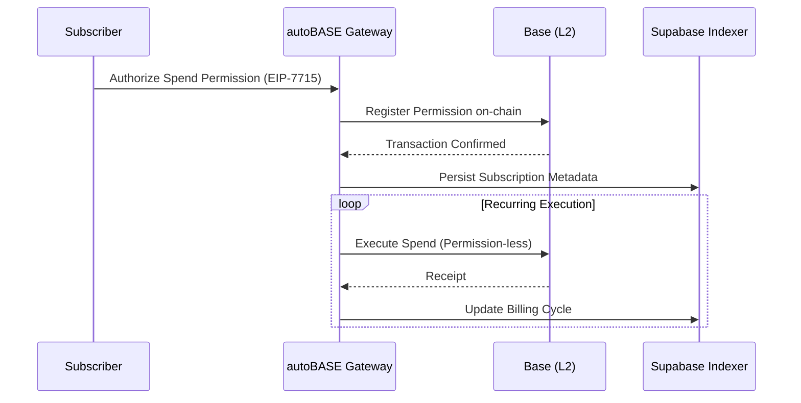

# autoBASE | System Architecture

## Executive Summary
autoBASE is a high-performance subscription infrastructure layer built on the Base network. It enables trustless, recurring revenue streams via EIP-7715 Spend Permissions, abstracting the complexity of on-chain asset orchestration into a Stripe-like developer experience.

## Architecture Overview
The system utilizes a decoupled, event-driven architecture designed for sub-second interface responsiveness and eventual consistency with the L2 state.

- **Gateway Layer**: Next.js 15+ edge-runtime environment handling high-concurrency user interactions.
- **Orchestration**: OnchainKit and Wagmi integration for EIP-7715 permission granting and transaction relaying.
- **Persistence**: Supabase (PostgreSQL) acting as a high-fidelity indexing layer for subscription metadata and user state.
- **State Synchronization**: Real-time monitoring of Base network events to maintain a consistent view of spend permissions and execution cycles.

## Transaction Lifecycle

## Key Engineering Decisions
- **EIP-7715 Spend Permissions**: Selected over traditional `approve/transferFrom` patterns to allow one-time signature authorization for infinite recurring cycles, significantly reducing churn and UX friction.
- **Off-chain Indexing**: Supabase is utilized to avoid expensive on-chain lookups for non-critical metadata, ensuring the dashboard maintains a latency profile of <50ms.
- **Zero-Trust Auth**: Strict JWT rotation and Clerk-based identity management ensure that only authenticated principals can access the orchestration gateway.

## Performance Constraints
- **L2 Throughput**: The system is bound by Base's block time and gas limits for initial permission registration. High-volume bursts are mitigated via internal transaction queuing.
- **State Lag**: There is an inherent ~2-5s window for on-chain state to propagate to the indexing layer.

## Security Posture
- **On-chain Enforcement**: All fund transfers are strictly governed by spend permissions enforced by the smart contract layer; the gateway cannot exceed authorized limits.
- **Encryption**: TLS 1.3 in transit; AES-256 for all sensitive environment variables and storage at rest.
- **Minimal Surface**: No custom smart contracts (leverages audited Base Spend Permissions primitives).
